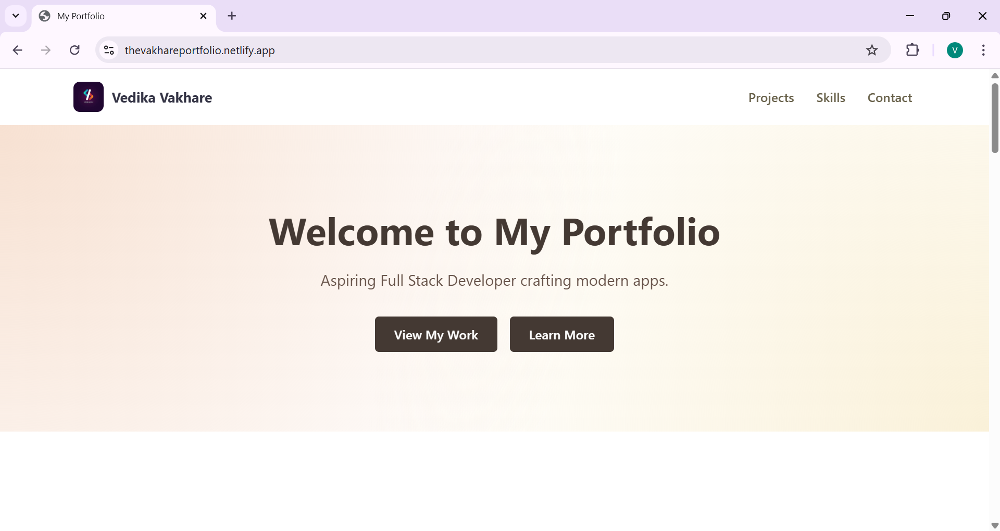
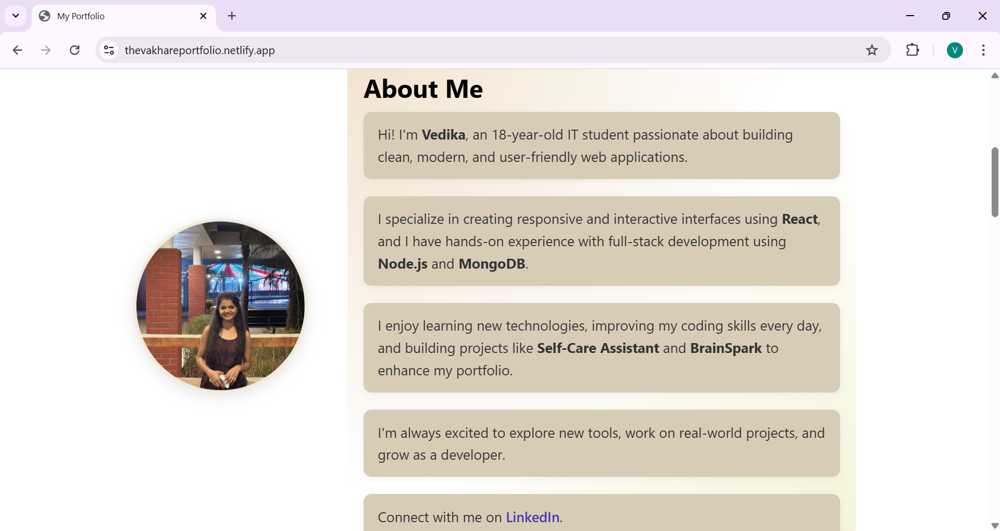
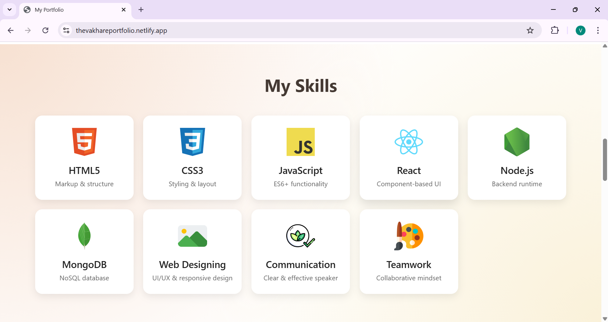
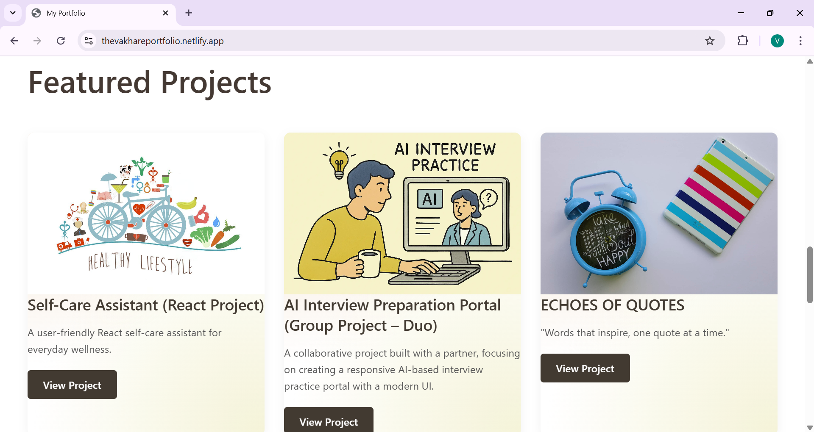
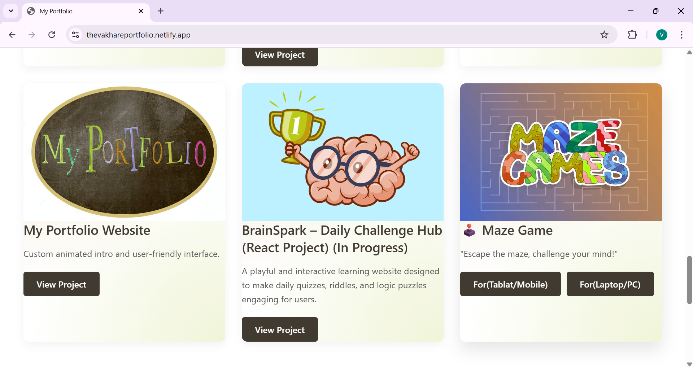
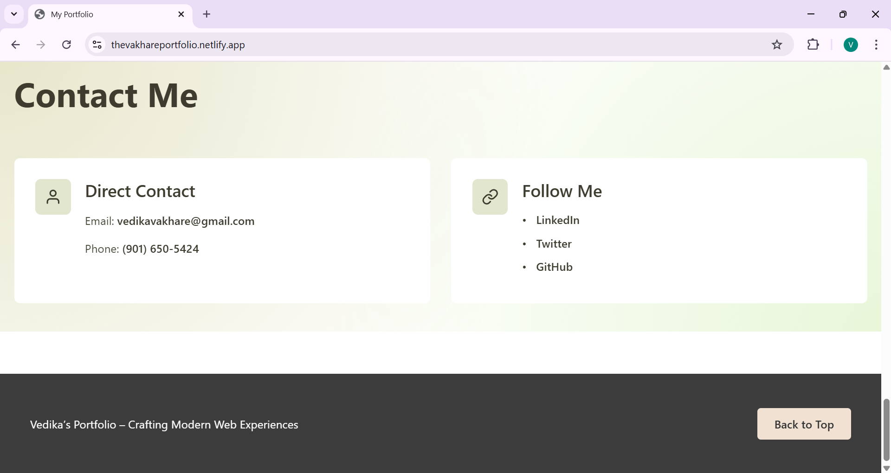

# 🌟 Personal Portfolio Website

A clean, modern, and responsive personal portfolio website designed to showcase my skills, projects, and learning journey as a web developer.

---

## 🚀 Overview

This portfolio highlights who I am, what I build, and the technologies I work with. It focuses on simplicity, usability, and a professional UI suitable for recruiters and collaborators.

---

## ✨ Key Features

* Modern and minimal UI design
* Fully responsive (mobile, tablet, desktop)
* Smooth animations and transitions
* Light & Dark theme support
* Well-structured sections: Home, About, Skills, Projects, Contact

---

## 🛠️ Tech Stack

* **HTML5** – semantic and accessible markup
* **CSS3** – modern styling, responsive layouts, animations
* **JavaScript** – interactivity and dynamic behavior

---

## 📁 Project Structure

```
├── index.html
├── style.css
├── script.js
├── assets/
│   └── images/
└── README.md
```

---

## 🖼️ Screenshots

### Home Page


### About Page


### Skills Section


### Projects Section



### Contact Page


---

## 🌐 Live Demo

https://thevakhareportfolio.netlify.app/

---

## 👩‍💻 Author

**Vedika**
Aspiring Full Stack Developer

* GitHub: [https://github.com/Vedi195](https://github.com/Vedi195)
* LinkedIn: [https://www.linkedin.com/](https://www.linkedin.com/)

---

⭐ If you find this project helpful or inspiring, feel free to star the repository!
